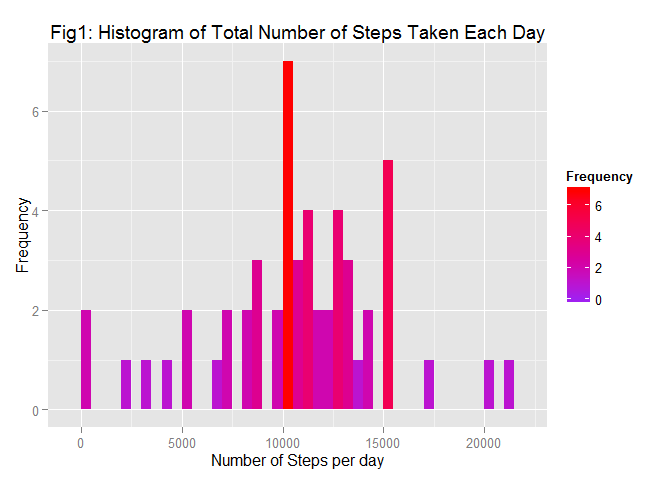
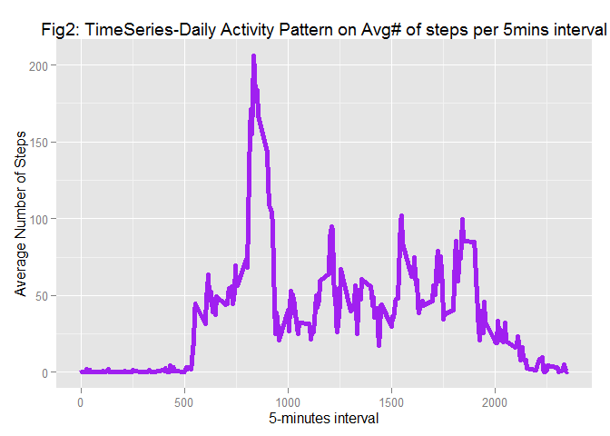
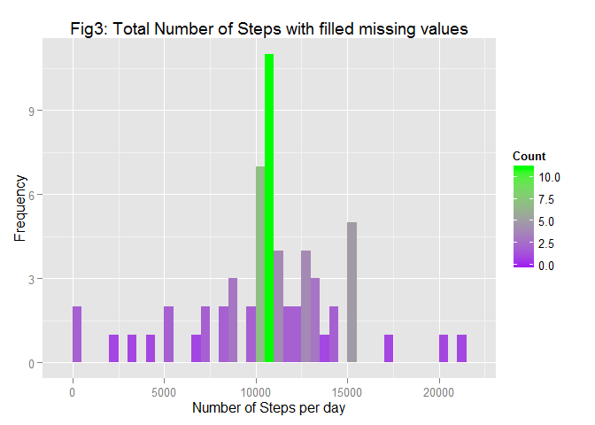
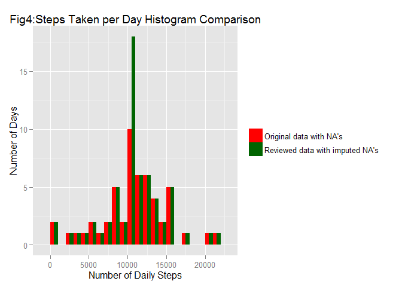
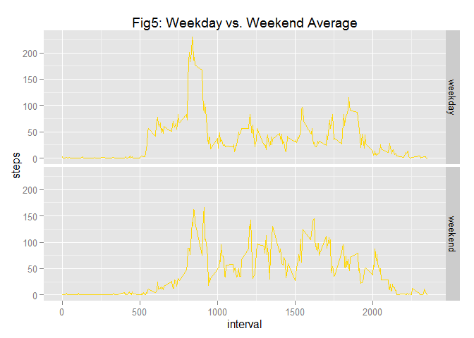
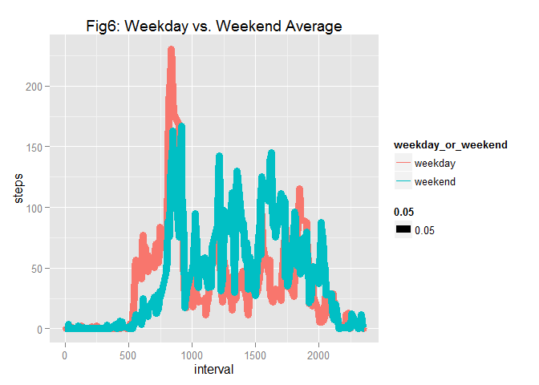

# Reproducible Research Course Project: Peer Assessment 1
JMTS  
Monday, November 9th, 2015  


## Summary

This assignment makes use of data from a personal activity monitoring device. This device collects data at 5 minute intervals throughout the day. The data consists of two months of data from an anonymous individual collected during the months of October and November, 2012 and include the number of steps taken in 5 minute intervals each day.


## What has to be accomplished
1.	Load the data (i.e. read.csv())
2.	Process/transform the data (if necessary) into a format suitable for the analysis
3.	Calculate the total number of steps taken per day
4.	Calculate and report the mean and median of the total number of steps taken per day
5.	Make a time series plot (i.e. type = "l") of the 5-minute interval (x-axis) and the average number of steps taken, averaged across all days (y-axis)
6.	Which 5-minute interval, on average across all the days in the dataset, contains the maximum number of steps?
7.	Calculate and report the total number of missing values in the dataset (i.e. the total number of rows with NAs)
8.	Devise a strategy for filling in all of the missing values in the dataset. The strategy does not need to be sophisticated. For example, you could use the mean/median for that day, or the mean for that 5-minute interval, etc.
9.	Create a new dataset that is equal to the original dataset but with the missing data filled in.
10.	Make a histogram of the total number of steps taken each day and Calculate and report the mean and median total number of steps taken per day. Do these values differ from the estimates from the first part of the assignment? What is the impact of imputing missing data on the estimates of the total daily number of steps?
11.	Create a new factor variable in the dataset with two levels - "weekday" and "weekend" indicating whether a given date is a weekday or weekend day.
12.	Make a panel plot containing a time series plot (i.e. type = "l") of the 5-minute interval (x-axis) and the average number of steps taken, averaged across all weekday days or weekend days (y-axis). See the README file in the GitHub repository to see an example of what this plot should look like using simulated data.

## Step1: Establish libraries needed for the project

```r
# Load "knitr", "grid",  "gridExtra", "ggplot2" and "lubridate" packages.
# Install the packages first if not installed yet
# Suppress the package warnings (Optional)

suppressWarnings(library(knitr))
suppressWarnings(library(gridExtra))
suppressWarnings(library(grid))
suppressWarnings(library(ggplot2))
suppressWarnings(library(lubridate))


library(knitr)
library(gridExtra)
library(grid)
library(ggplot2)
library(lubridate)
```

## Step 2: Assignment Responses
###	Loading and preprocessing the data


```r
# Unzip the activity data file 
unzip("activity.zip", exdir = "activity")

#Set the correct working directory
setwd("C:/Users/tiani_000/Desktop/courserarpogramming/RepData_PeerAssessment1/activity")

# download and read the data

data <- read.csv("activity.csv", colClasses = c("numeric", "Date", "numeric"))
```


```r
#First few data in the file
head(data)
```

```
##   steps       date interval
## 1    NA 2012-10-01        0
## 2    NA 2012-10-01        5
## 3    NA 2012-10-01       10
## 4    NA 2012-10-01       15
## 5    NA 2012-10-01       20
## 6    NA 2012-10-01       25
```


### What is mean total number of steps taken per day?

#### 1. Compute the total steps that were taken everyday
We will be first using the aggregate function to calculate the total number of steps taken per day.


```r
tnstpd <- aggregate(steps ~ date, data, FUN = sum)

#Let's put a label to this function to easily track it
tnstpd <- cbind(tnstpd, label = rep("with.na", nrow(tnstpd)))
```


#### 2. Now, we can go ahead and plot the function as an Histogram

```r
# Plotting our first Histogram
library(ggplot2)

ggplot(tnstpd,aes(x = tnstpd$steps)) + geom_histogram(aes(fill=..count..), binwidth=500) + scale_fill_gradient("Frequency",low = "purple",high = "red") + labs(title = "Fig1: Histogram of Total Number of Steps Taken Each Day",x = "Number of Steps per day", y = "Frequency")
```

 

#### 3. Calculate and report the mean and median of the total number of steps taken per day

```r
# print summary (includes mean & median)

summary(tnstpd)
```

```
##       date                steps           label   
##  Min.   :2012-10-02   Min.   :   41   with.na:53  
##  1st Qu.:2012-10-16   1st Qu.: 8841               
##  Median :2012-10-29   Median :10765               
##  Mean   :2012-10-30   Mean   :10766               
##  3rd Qu.:2012-11-16   3rd Qu.:13294               
##  Max.   :2012-11-29   Max.   :21194
```

```r
# Calculated Mean and Median
Mean1 <- mean(tnstpd$steps)
print(Mean1)
```

```
## [1] 10766.19
```

```r
Median1 <- median(tnstpd$steps)
print(Median1)
```

```
## [1] 10765
```
The Mean is 10766.19 and the Median is 10765.

### What is the average daily activity pattern?
Observing the average number of steps taken over each 5 minute interval to find the average daily activity pattern


```r
# Compute average number of steps per interval
gap <- aggregate(steps ~ interval, data, FUN = mean)
```
#### 1. Make a time series plot (i.e. type = "l") of the 5-minute interval (x-axis) and the average number of steps taken, averaged across all days (y-axis)


```r
# Plotting our Time Series graph

dessin <- ggplot(gap, aes(x = interval, y = steps)) 
dessin + geom_line(color="purple", size=2) + xlab("5-minutes interval") + ylab("Average Number of Steps") + ggtitle("Fig2: TimeSeries-Daily Activity Pattern on Avg# of steps per 5mins interval") 
```

 

#### 2. Which 5-minute interval, on average across all the days in the dataset, contains the maximum number of steps?


```r
# Caltucale which interval has the maximum number of steps
gap$interval[which.max(gap$steps)]
```

```
## [1] 835
```
The 835th 5-minute interval contains the maximum number of steps.

### Imputing missing values

#### 1.	Calculate and report the total number of missing values in the dataset (i.e. the total number of rows with NAs)


```r
# total number of missing data from the original data set.
      sum(is.na(data$steps))
```

```
## [1] 2304
```

#### 2.	Devise a strategy for filling in all of the missing values in the dataset. The strategy does not need to be sophisticated. For example, you could use the mean/median for that day, or the mean for that 5-minute interval


```r
##Let us first populate the missing values by replacing them with the mean value using the interval per days
##We will need to install and load the following packages for this section:
library(plyr)
```

```
## Warning: package 'plyr' was built under R version 3.2.2
```

```
## 
## Attaching package: 'plyr'
## 
## The following object is masked from 'package:lubridate':
## 
##     here
```

```r
library(dplyr)
```

```
## Warning: package 'dplyr' was built under R version 3.2.2
```

```
## 
## Attaching package: 'dplyr'
## 
## The following objects are masked from 'package:plyr':
## 
##     arrange, count, desc, failwith, id, mutate, rename, summarise,
##     summarize
## 
## The following objects are masked from 'package:lubridate':
## 
##     intersect, setdiff, union
## 
## The following objects are masked from 'package:stats':
## 
##     filter, lag
## 
## The following objects are masked from 'package:base':
## 
##     intersect, setdiff, setequal, union
```

```r
imvdt <- adply(data, 1, function(x) if (is.na(x$steps)) {
    x$steps = round(gap [gap$interval == x$interval, 2])
    x
} else {
    x
})
```

```r
##add a label to track the information and Compute the total number of steps for missing values
tnstpd.impute <- aggregate(steps ~ date, imvdt, sum)
tnstpd.impute <- cbind(tnstpd.impute, label = rep("without.na", nrow(tnstpd.impute)))
```

```r
##Plot the Histogram including the filled missing values
library(ggplot2)

ggplot(tnstpd.impute,aes(x = tnstpd.impute$steps)) + geom_histogram(aes(fill=..count..), binwidth=500) +scale_fill_gradient("Count",low = "purple",high = "green") + labs(title = "Fig3: Total Number of Steps with filled missing values",x = "Number of Steps per day", y = "Frequency")
```

 

```r
##Calculating the corresponding mean and median
Mean2 <- mean(tnstpd.impute$steps)
print(Mean2)
```

```
## [1] 10765.64
```

```r
Median2 <- median(tnstpd.impute$steps)
print(Median2)
```

```
## [1] 10762
```

```r
summary(tnstpd.impute)
```

```
##       date                steps              label   
##  Min.   :2012-10-01   Min.   :   41   without.na:61  
##  1st Qu.:2012-10-16   1st Qu.: 9819                  
##  Median :2012-10-31   Median :10762                  
##  Mean   :2012-10-31   Mean   :10766                  
##  3rd Qu.:2012-11-15   3rd Qu.:12811                  
##  Max.   :2012-11-30   Max.   :21194
```
With the above results, we can see that the mean and median have shifted from the original mean and median.

#### 3.	Create a new dataset that is equal to the original dataset but with the missing data filled in.

```r
tnstpd$type <- as.factor("Original data with NA's")
tnstpd.impute$type <- as.factor("Reviewed data with imputed NA's")
tnstpd.all <- rbind(tnstpd, tnstpd.impute)
```

#### 4. Make a histogram of the total number of steps taken each day and Calculate and report the mean and median total number of steps taken per day. Do these values differ from the estimates from the first part of the assignment? What is the impact of imputing missing data on the estimates of the total daily number of steps?


```r
##Plot the combined histogram for comparison
ggplot(tnstpd.all , aes(steps, fill = type))+ theme(legend.title= element_blank())+ geom_bar(position= "dodge", binwidth= 1000)+ labs(title = "Fig4:Steps Taken per Day Histogram Comparison", x="Number of Daily Steps", y="Number of Days") + scale_fill_manual(values=c("red","darkgreen"))
```

 


### Are there differences in activity patterns between weekdays and weekends?
#### 1.	Create a new factor variable in the dataset with two levels - "weekday" and "weekend" indicating whether a given date is a weekday or weekend day.


```r
#Displaying internal structure of created object
 str(imvdt)
```

```
## 'data.frame':	17568 obs. of  3 variables:
##  $ steps   : num  2 0 0 0 0 2 1 1 0 1 ...
##  $ date    : Date, format: "2012-10-01" "2012-10-01" ...
##  $ interval: num  0 5 10 15 20 25 30 35 40 45 ...
```

```r
#Using the Lubridate package to make it easier to deal with the date range 
library(lubridate)

#Using lubridate function "ymd" to  make the date function return numeric value
imvdt$date <- ymd(imvdt$date)

#Setting the weekday to return a value between 1and 7 with Sunday being #1 and Saturday being#7.
weekday_or_weekend <- ifelse(wday(imvdt$date) %in% c(1, 7), "weekend", "weekday")
poa <- data.frame(imvdt, weekday_or_weekend)

#aggregate the new data by steps as a function of interval per day
moyendesSteps <- aggregate(steps ~ weekday_or_weekend + interval, data = poa, mean)
```
#### 2. Make a panel plot containing a time series plot (i.e. type = "l") of the 5-minutes interval (x-axis) and the average number of steps taken, averaged across all weekday days or weekend days (y-axis). See the README file in the GitHub repository to see an example of what this plot should look like using simulated data.


```r
library(ggplot2)
qplot(interval, steps, data = moyendesSteps, facets = weekday_or_weekend~.,
geom = "line", colour = I("gold"),fill = I("gold"), main="Fig5: Weekday vs. Weekend Average")
```

 

#### 3. Plot weekday over weekend time series


```r
qplot(interval, steps, data = moyendesSteps, color = weekday_or_weekend, geom = "line",size=0.05, main="Fig6: Weekday vs. Weekend Average" )
```

 

##### Observations on this last comparison:

Patterns are different for weekdays and weekends. Looks like the highest activities are done over the weekend. Activities are lower during weekdays properly due to a job and the peak of activities during weekdays might be due to an exercise regimen.

## Credits

1. "Reproducible Research", by Roger D. Peng, PhD, Jeff Leek, PhD, Brian Caffo, PhD, Coursera. 
[link](https://class.coursera.org/repdata)

2. "Peer Assessments / Peer Assessment 1", Reproducible Research : by Roger D. Peng, PhD, Jeff Leek, PhD, Brian Caffo, PhD, Coursera.
[link](https://class.coursera.org/repdata-034/human_grading/view/courses/975147/assessments/3/submissions)

3. "R Package reference", A Community Site for R - Sponsored by Revolution Analytics.
[link](http://www.inside-r.org/packages/cran)

4. "Quick-R: accessing the power of R" 
[link](http://www.statmethods.net/advgraphs/index.html)

5. "Comparing plot variables with average results""
[link](http://stackoverflow.com/questions/31585443/comparing-plot-variables-with-average-results)

6. "R Markdown Cheat Sheet" [link](https://www.rstudio.com/wp-content/uploads/2015/02/rmarkdown-cheatsheet.pdf)


